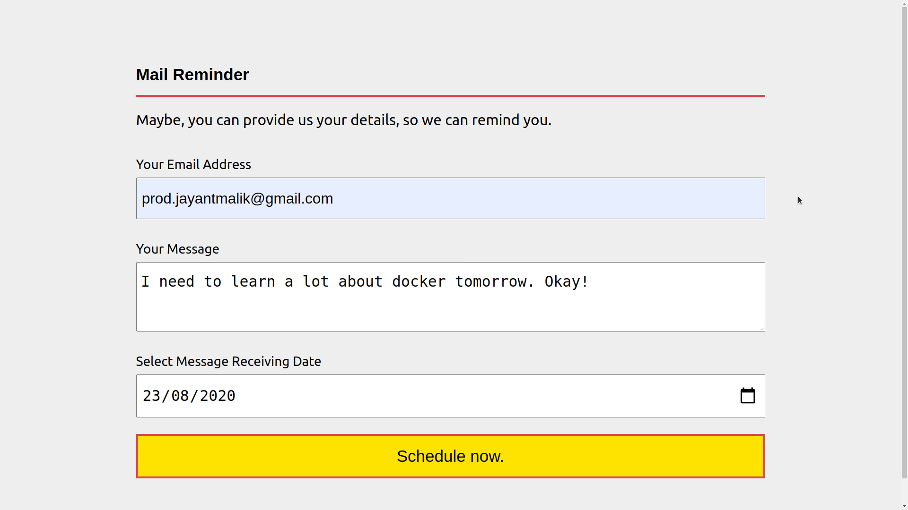
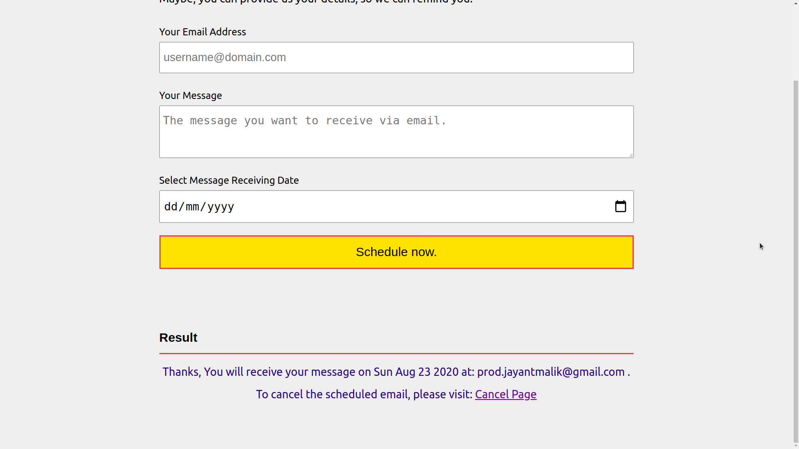
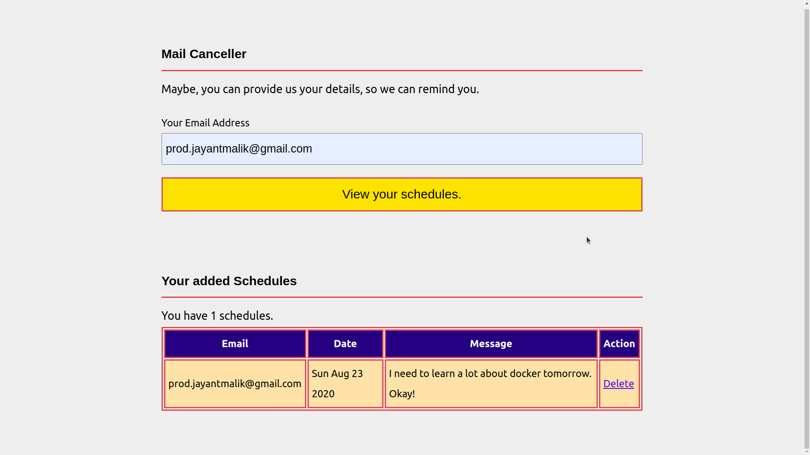

# Mail Reminder

## Setup Instruction

- Clone the repo
- Setup the environment variables.
- Start the app

## Useful Routes

We need to manually visit [https://devjayantmailik-mail-reminder.glitch.me/process](https://devjayantmailik-mail-reminder.glitch.me/process) to send emails that are registered for today. Because we are using free plan, and free plan do not support cron jobs. Thanks.

## Completed App

